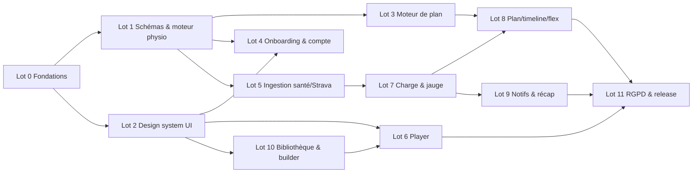

# Runly — Plan d'implémentation pour agents IA

> **Version** : 1.1 — 16/07/2026
> **Objet** : plan d'exécution du MVP Runly (spec v0.3, backlog ~203 pts) découpé en lots autonomes exécutables par des agents IA, avec pour chaque lot : documents d'entrée, livrables, critères de vérification automatisables, et points de contrôle humains.
> **v1.1 (arbitrages Cédric, 16/07/2026)** : architecture **mono-app Expo + yarn** (pas de monorepo) ; pas de react-native-paper ; H1 (compréhension jauge) et H2 (acceptation RPE) **assumées validées** — pas de test utilisateur préalable ; spikes device réel **mis de côté** — on assume que les données remontent correctement via Apple Santé / Health Connect ; données applicatives persistées dans Supabase (administrables ensuite via back-office ou SQL).
> **Prérequis de lecture pour tout agent** : ce fichier + la section « Règles transverses » ci-dessous. Chaque lot liste ensuite ses documents d'entrée spécifiques.

---

## 0. Documents canoniques (source de vérité)

| Document | Rôle | Autorité |
|---|---|---|
| `specs-mvp-app-running.md` (v0.3) | Spec fonctionnelle complète, US + critères d'acceptation | **Canonique** — en cas de conflit, elle prime |
| `decisions-cadrage-mvp.md` | 16 décisions actées (D1–D16) | Canonique |
| `backlog-mvp.md` | Epics E0–E10, stories estimées, plan de sprints | Canonique (découpage) |
| `stack-technique.md` | Choix techniques validés | Canonique |
| `design-system-runly.md` (v1.1) | Tokens, composants signatures, UX writing | Canonique pour toute UI |
| `navigation-app-running.mermaid` | Architecture de navigation (4 tabs, modaux, sheets) | Canonique pour expo-router |
| `note-reglementaire-dm.md` | Wording proscrit/recommandé | **Bloquant** : tout texte UI passe ce filtre |
| `synthese-lantelme.md` | Fondation scientifique → règles produit | Référence pour `training-engine` |
| `spike-sources-donnees.md` | Couverture santé/Strava par marque | Référence pour E6 |
| `prototype-mvp-running.html` | Proto de démo | **Non canonique** (3 tabs, FC live : obsolète, écart assumé) |

## 1. Règles transverses (à respecter par TOUS les agents)

1. **TypeScript strict** partout ; aucune donnée externe (santé, Strava, formulaires) n'entre dans le domaine sans passer par un schéma zod de `src/schemas`.
2. **Wording réglementaire** : tout texte visible par l'utilisateur (UI, notifications, fiches, stores) respecte le tableau proscrit/recommandé de `note-reglementaire-dm.md`. Jamais « blessure », « risque de blessure », ni pathologie nommée dans l'UI. Ton : coach bienveillant, tutoiement (charte §5).
3. **i18n-ready (D7)** : aucune string en dur dans les composants — tout passe par le module i18n (FR seul au MVP) ; formats nombre/date/allure via helpers centralisés (`4:59 /km`, virgule décimale française).
4. **Design tokens obligatoires** : aucune couleur/taille/rayon en dur — uniquement les tokens de `design-system-runly.md`. Le rouge `danger` est réservé à la jauge > 1,3 et aux alertes de pic, rien d'autre.
5. **Logique métier = fonctions pures testées** dans `src/training-engine` (plan, VMA, allures, ACWR, alertes). Les composants React ne contiennent pas de règles métier.
6. **Offline-first** : le player et la saisie RPE fonctionnent sans réseau (expo-sqlite) ; la sync Supabase est une réconciliation, pas une condition.
7. **Données de santé minimisées** : on persiste dans Supabase des agrégats de séance (durée, distance, FC moyenne, cadence moyenne, charge) — administrables ensuite —, jamais les séries FC brutes ni le GPS brut en base (spec §9).
8. **Definition of Done d'une story** : code + tests (unitaires jest pour la logique ; Maestro pour les parcours critiques listés au lot) + `yarn lint && yarn type-check && yarn test` verts + wording vérifié + revue humaine si le lot est marqué 🔍.
9. **Conventions** : Conventional Commits ; une PR par story (ou groupe cohérent ≤ 5 pts) ; jamais de merge direct sur `main`.
10. **Un agent ne décide pas seul** d'un écart à la spec : tout écart découvert (contradiction, impossibilité technique) est remonté en issue avec proposition, jamais résolu silencieusement.

## 2. Architecture cible (mono-app Expo + yarn)

Pas de monorepo : **un seul projet Expo**, géré avec **yarn**. La séparation des responsabilités se fait par modules internes ; `supabase/` vit dans le même repo.

```
runly/
├── app/                        # expo-router : 4 tabs + stacks conformes au mermaid
│   ├── (tabs)/                 #   accueil / plan / seances / profil
│   ├── onboarding/
│   └── player/                 #   modal plein écran
├── src/
│   ├── schemas/                # zod : SessionBlock, Workout, Plan, Goal, PhysioProfile…
│   ├── training-engine/        # fonctions pures : plan, VMA, allures, ACWR, alertes (zéro import React)
│   ├── ui/                     # tokens du design system + composants signatures
│   ├── features/               # onboarding, plan, player, library, load, profile (écrans + stores zustand)
│   ├── services/               # healthkit, health-connect, strava, supabase, sqlite, notifications, audio
│   ├── i18n/                   # strings FR externalisées + helpers de format
│   └── lib/                    # utilitaires purs
├── supabase/
│   ├── functions/              # Edge Functions : webhook Strava, ingestion
│   ├── migrations/
│   └── seed/
├── docs/
│   └── adr/                    # ADR-001…N
├── AGENTS.md                   # ← symlink CLAUDE.md ; règles transverses §1 + stack
├── package.json                # yarn ; scripts lint / type-check / test / e2e
└── .github/workflows/ci.yml    # lint, type-check, test, build
```

Contraintes de dépendances entre modules (à faire respecter par règle ESLint) : `training-engine` et `schemas` n'importent ni React ni Expo ; `ui` n'importe pas `features` ; `features` ne touche jamais directement HealthKit/Strava (toujours via `services`). Les Edge Functions (Deno) restent limitées à l'ingestion — le moteur de plan s'exécute côté client.

**Stack** (détail : `stack-technique.md`) : Expo SDK 56 + dev client + EAS ; expo-router ; zustand (état local) + TanStack Query (état serveur) ; zod ; Skia + Reanimated (jauge) ; victory-native XL (P1) ; @kingstinct/react-native-healthkit v14 (pinnée) ; react-native-health-connect 3.5.3 ; expo-location/-task-manager/-audio/-speech/-keep-awake/-sqlite/-background-task ; Supabase UE (Auth, Postgres+RLS, Edge Functions) ; Sentry (crash uniquement, D10) ; jest + Maestro.

**Décision UI actée** : **pas de react-native-paper**. Composants maison sur primitives RN pour tout (jauge, player, stat-cards, timeline, pills, CTA, inputs, sheets) dans `src/ui`.

## 3. Points de contrôle humains

Arbitrages du 16/07/2026 — deux gates initialement bloquants sont **assumés** :

| # | Gate | Statut | Impact |
|---|---|---|---|
| G1 | Test utilisateur H1–H5 | ✅ **Assumé** : H1 (jauge comprise) et H2 (RPE accepté) considérés validés | La jauge et l'écran RPE s'implémentent tels que spécifiés, sans attendre |
| G2 | Spikes device réel (TTS verrouillé, Health Connect Garmin/Coros, GPS terrain) | ✅ **Assumé** : les données remontent correctement via Apple Santé / Health Connect | Dev contre les APIs et des fixtures ; garder l'abstraction audio du Lot 6 comme filet |
| G3 | **Coach relecteur** (D8) : validation sorties du moteur (6 personas) + relecture fiches | 🧑 Actif — à identifier dès V0 | Bloque la beta, pas le dev |
| G4 | **Avocat DM/e-santé** : note réglementaire + CGU | 🧑 Actif | Bloque la release stores |
| G5 | **Comptes & quotas externes** : Apple/Google developer, quota Strava (Single Player Mode → montée), déclarations données santé | 🧑 Actif — à lancer dès V0 (délais externes) | Bloque Lot 5 (Strava en prod) et Lot 11 |
| G6 | Échelle RPE emoji vs chiffres (question #6) | ✅ Tranché par défaut : 0–10 avec ancres émoji | Ajustable en beta si besoin |

## 4. Lots d'implémentation

Chaque lot référence les stories du backlog (autorité sur le contenu détaillé). Ordre = dépendances ; les pistes A/B/C peuvent être parallélisées entre agents après le Lot 0.



- **Piste A (logique)** : L1 → L3 → (L8)
- **Piste B (UI/parcours)** : L2 → L4, L10 → L6
- **Piste C (données)** : L5 → L7 → L9
- Convergence : L8 puis L11.

---

### Lot 0 — Fondations (E0 ; 23 pts)

**Entrées** : `stack-technique.md`, `design-system-runly.md`, ce plan §2.
**Contenu** :
- Scaffolding : projet Expo SDK 56 unique (**yarn**, dev client, TS strict), expo-router avec 4 tabs conformes au mermaid, arborescence `src/` du §2, règles ESLint de frontières entre modules (E0-1).
- i18n-ready : lib i18n installée, FR seul, helpers de format (allure `m:ss /km`, virgule décimale, `≈`) dans `src/i18n` (D7).
- Supabase UE (Francfort/Paris) : projet, auth email + Apple/Google, migrations initiales du modèle §9 de la spec (User, PhysioProfile, Goal, TrainingPlan→PlannedSession, Workout, SessionFeedback, LoadMetrics, Alert), RLS par user, environnements dev/staging/prod (E0-2). Les données applicatives y sont persistées et administrables (SQL / back-office ultérieur).
- ADR (docs/adr) : ADR-001 mono-app Expo + yarn (pas de monorepo), ADR-002 stack, ADR-003 Supabase Auth + compte en fin d'onboarding (D2), ADR-004 modèle de données & minimisation santé, ADR-005 Edge Functions (ingestion seule), ADR-006 zod aux frontières, ADR-007 conventions, ADR-008 composants maison (pas de Paper), ADR-009 offline-first/sqlite, ADR-010 ACWR rolling 7/28 (D16).
- `AGENTS.md` (symlink `CLAUDE.md`) reprenant §1 et §2 de ce plan.
- CI GitHub Actions : lint, type-check, test, build EAS (E0-1) ; Sentry crash-only (E0-5, **pas de PostHog** — D10).
- 🧑 G5 : lancer immédiatement les demandes externes (quota Strava, comptes stores, déclarations santé).

**Vérification** : `yarn install && yarn lint && yarn type-check && yarn test` verts en CI ; app démarre sur simulateur avec 4 tabs vides ; migrations appliquées sur dev.

---

### Lot 1 — Schémas & références physiologiques (E4-1, E2 ; ~14 pts)

**Entrées** : spec §7.5, §9 ; backlog E2, E4-1 ; `synthese-lantelme.md`.
**Contenu** :
- `src/schemas` : `SessionBlock` (répétitions × durée|distance @ allure|zoneFC|RPE, récup, blocs imbriqués/séries), `Workout` multi-sources (healthkit|healthconnect|strava|player|manuel), profil, objectif, plan — le modèle de séance en blocs est **la** structure pivot (player/plan/builder) et doit être sérialisable (P2 montre).
- `src/training-engine` : estimation VMA depuis historique (meilleurs efforts 5–12 min, puissance critique simplifiée) ; FCmax (max observé sinon Tanaka 208 − 0,7 × âge) ; SV1/SV2 en % VMA ; tables allures 5K/10K/semi/marathon croisées ambition ; 5 zones FC en % FCmax. Chaque valeur porte un indice de confiance `mesuré|estimé|défaut`.
- Écran Profil > Références physio : édition, badges de provenance (`warn` pour estimé), historique des révisions, protocole demi-Cooper expliqué (test guidé = P1) (E2-4) ; proposition de recalcul non imposée (E2-5).

**Vérification** : tests unitaires sur jeux de données réels (fixtures d'historiques variés : débutant, régulier, données creuses) ; cas canonique de la spec §7.3 : objectif semi 1h45 → allure semi ≈ 4:59/km, zone FC 88–92 % FCmax.

---

### Lot 2 — Design system UI (E0-3 ; 5 pts, étendu)

**Entrées** : `design-system-runly.md` v1.1 (intégralité).
**Contenu** : `src/ui` — thème (tokens couleurs/typo/rayons/espacements en constantes typées), composants : Button (CTA pill + ghost), Card/Chip/Pill, StatCard + trio, Label MAJUSCULES, timeline stepper vertical, checklist hebdo, tab bar 4 onglets, bottom sheet, inputs. `tabular-nums` sur tout chiffre dynamique. Storybook ou écran galerie interne pour revue visuelle 🔍.

**Vérification** : galerie complète ; zéro couleur en dur hors thème (règle lint) ; contrastes AA vérifiés sur les paires token (script de check).

---

### Lot 3 — Moteur de plan périodisé (E3 ; 21 pts) — cœur algorithmique 🔍

**Entrées** : spec §5, §7.2 ; backlog E3 ; `synthese-lantelme.md`.
**Contenu** : dans `src/training-engine`, **fonction pure** `(profil, objectif, historique) → plan`, déclenchée uniquement si objectif daté (D5) :
- Phases générale → spécifique → affûtage 7–14 j ; 1 semaine allégée / 3–4 ; ~80 % volume EF + 1–2 qualités/sem ; progression hebdo ≤ 10 % (5–8 % si antécédent < 12 mois) ; refus < 2 séances/sem ; distances 5K/10K/semi/marathon.
- Placement sur jours dispo avec règles d'enchaînement : jamais 2 qualités d'affilée, pas de qualité la veille de la sortie longue (E3-2).
- Garde-fou objectif irréaliste (date trop proche vs volume) → alternatives : autre objectif, « finir », date ultérieure (spec §7.2).
- Re-génération du plan restant (changement dispo ; rupture ≥ 2 sem → re-périodisation proposée) (E3-3) ; séance manquée à J+1 → re-proposition de la clé, abandon de la secondaire, on n'empile jamais (E3-5).

**Vérification** : **golden files par persona** (≥ 6 : Marc semi-14 sem-3 j ; marathon prudent post-blessure ; 5K débutant-intermédiaire 2 j → refus/recommandation ; 10K chrono 5 j ; objectif irréaliste ; sans historique) — tout changement de sortie du moteur = diff explicite en PR. Propriétés testées : chaque semaine ≤ +10 % (ou 5–8 %), affûtage présent, % EF, enchaînements valides.
🧑 G3 : les golden files sont le support de la validation coach (E3-4) — exporter un rendu lisible (markdown) des 6 plans.

---

### Lot 4 — Onboarding, compte & profil (E1 ; 22 pts) 🔍

**Entrées** : spec §6.1 ; backlog E1 ; mermaid (OB1→OB4) ; `spike-sources-donnees.md` (guides par marque).
**Contenu** : flux complet : permissions santé avec pré-explication (jamais de prompt à froid) → profil (âge **16+ vérifié**, antécédents → flag prudence) → contexte (séances/sem min 2, jours, volume pré-rempli) → objectif **skippable** (garde-fou irréaliste) → **création de compte en fin** (email + Apple/Google ; données locales avant compte, rattachement + sync à la création, restauration multi-device D14) → restitution (plan ou semaine type + 3 écrans pédagogie jauge + guides d'activation du partage par marque). Import historique 26 sem → normalisation zod → base ; état « jauge en calibration » si < 4 sem. Refus permissions → mode 100 % déclaratif. Chaque étape skippable avec défaut ; reprise où on s'est arrêté.

**Vérification** : Maestro E2E : (a) parcours nominal avec objectif → plan affiché ; (b) skip objectif → semaine type ; (c) refus santé → mode déclaratif ; (d) âge < 16 → blocage. Test unitaire : rattachement des données locales au compte sans perte.

---

### Lot 5 — Ingestion des séances (E6 ; 22 pts)

**Entrées** : spec §7.7 ; backlog E6 ; `spike-sources-donnees.md`.
**Contenu** : couche d'ingestion normalisée multi-sources → `Workout` zod unique persisté dans Supabase (agrégats) ; filtre activités « course » ; déduplication date/durée/distance, priorité Strava > santé (E6-1). Lecture HealthKit (observer + refresh foreground) (E6-2) ; Health Connect (polling expo-background-task ≥ 15 min + foreground ; permissions historique >30 j et background) (E6-3) ; Strava OAuth (expo-auth-session) + webhook → Edge Function + import (E6-4) ; matching réalisé↔planifié (même jour ± tolérance) avec **ré-association/dissociation en 1–2 taps** (D11) (E6-5) ; saisie manuelle durée/distance/RPE (E6-6).

**Vérification** : tests unitaires de déduplication (doublon Strava+santé, séances proches, multi-jours) et de matching (nominal, ambigu, faux positif corrigé) sur fixtures ; Edge Function testée (payload webhook Strava simulé). On assume la remontée correcte des données santé (G2 assumé) ; 🧑 G5 conditionne seulement Strava en production.

---

### Lot 6 — Player de séance (E5 ; 29 pts) — module le plus risqué 🔍

**Entrées** : spec §7.4 ; backlog E5 ; charte §4 (player).
**Contenu** :
- Machine à états de séance (blocs, transitions, pause/reprise/abandon) persistée sur expo-sqlite à chaque transition — **crash-safe : une séance ne se perd jamais** (E5-1).
- Tracking : expo-location en foreground service (éviter `ACCESS_BACKGROUND_LOCATION`), allure lissée (fenêtre glissante, cf. `stack-technique.md`), distance cumulée ; **pas de FC temps réel** (D6) ; **perte GPS = dégradation gracieuse** (timer/structure continuent, allure figée + badge « signal faible », distance reprend) (D13) (E5-2).
- UI conforme charte : timer géant tabular, barre d'allure cible avec curseur, trio allure/distance/durée, bannière coaching (« dans la cible »), prochain bloc, fond dégradé vert dans la cible, chip GPS (E5-3).
- Audio écran verrouillé : implémentation **TTS (expo-speech + `UIBackgroundModes: ["audio"]`)** par défaut, derrière une abstraction `AnnouncementPlayer` qui permet de basculer sur des fichiers pré-enregistrés si le TTS s'avère fragile en beta (plan B documenté dans `stack-technique.md`) (E5-4).
- Fin de séance : récap + écriture workout vers santé + enchaînement RPE (E5-5) ; mode carte (courir avec sa montre, matching différé) (E5-6) ; Live Activity iOS via expo-apple-targets (`Text(timerInterval:)`, updates aux transitions seulement) + notification riche Android (E5-7).

**Vérification** : tests unitaires machine à états (toutes transitions, kill/restore process) ; simulation GPS (mock location + traces GPX rejouées : nominal, perte de signal, dérive) ; critères spec : dérive timer < 1 s/h (test simulé), structure de séance jamais interrompue. La consommation batterie (< 15 %/h) et l'audio verrouillé se valident en beta.

---

### Lot 7 — Charge & jauge ACWR (E7 ; 18 pts) — le différenciateur 🔍

**Entrées** : spec §7.6 ; backlog E7 ; `synthese-lantelme.md` ; charte §4 (jauge) ; `note-reglementaire-dm.md`.
**Contenu** : dans `src/training-engine` : charge = sRPE (RPE × durée), fallback durée × zone moyenne (amorçage historique, D4) avec **normalisation des UA entre méthodes** (test explicite : pas de « marche » dans la chronique à la bascule) ; ACWR rolling 7 j / moyenne 28 j (D16) ; état calibration < 4 sem (alertes désactivées). UI : jauge Skia demi-cercle 3 zones (bleu 0,6–0,8 / vert 0,8–1,3 / rouge 1,3–1,6), aiguille Reanimated, valeur « 1,12 », pill de statut, écran « Comment ça marche ? » ; ACWR **prévisionnel** si plan suivi. Moteur d'alertes : pic > 1,3 → substitution 1 tap + « Garder mon plan » ; sous-charge > 2 sem ; RPE ≥ 8 × 2 séances → allègement ; **max 1 alerte charge/48 h** ; décision utilisateur tracée (`Alert`). Saisie RPE post-séance + notification 30 min après import ; échelle **0–10 avec ancres émoji** (G6 tranché).

**Vérification** : tests unitaires exhaustifs ACWR (trous de données, blessure/arrêt, reprise, bascule amorçage→sRPE, fenêtres partielles) ; tests du throttling d'alertes ; **revue wording** : chaque message d'alerte confronté au tableau proscrit/recommandé (checklist en PR).

---

### Lot 8 — Plan, timeline, objectif & flexibilité (E8 ; 18 pts)

**Entrées** : spec §7.9, §7.10 ; backlog E8 ; mermaid.
**Contenu** : Accueil (semaine 7 jours fixes lun→dim, jours de repos affichés, statuts) ; onglet Plan (timeline continue passé réalisé-vs-prévu / futur avec phases et semaines allégées) ; déplacer une séance (bottom sheet + recalcul ACWR prévisionnel + avertissement jamais blocage sur enchaînements déconseillés) ; ajouter une séance spontanée (suggestion d'allègement **seulement si** sortie de zone — sinon l'app se tait) ; détail séance passée prévu/réalisé par bloc ; **mode semaine type** (sans objectif, 100 % manuel) (E8-6) ; **CRUD objectif dans l'onglet Plan** avec bascule plan généré ↔ semaine type (E8-7).

**Vérification** : Maestro : déplacer une séance et voir l'impact jauge ; créer puis supprimer un objectif (bascule semaine type sans perte de données) ; tests unitaires des règles d'avertissement de déplacement.

---

### Lot 9 — Notifications & récap hebdo (E9 ; 8 pts)

**Entrées** : spec §6.2 ; backlog E9 ; charte §5.
**Contenu** : notifs « ta semaine » (lundi), rappel séance du jour, demande RPE (30 min post-détection) ; préférences par type ; récap hebdo dimanche soir (réalisé vs prévu, évolution ACWR, message d'adaptation). Pas de streaks/relances (D15). Wording : filtre réglementaire.

**Vérification** : tests de planification des notifs (timezone, préférences off) ; snapshot du contenu du récap sur fixtures.

---

### Lot 10 — Bibliothèque pédagogique & builder (E4 ; 16 pts)

**Entrées** : spec §7.3 ; backlog E4 ; charte.
**Contenu** : onglet Séances = bibliothèque librement explorable, 7 types (EF, sortie longue, VMA court, seuil, tempo, fartlek, récupération) ; fiche : quoi (1 phrase), quoi développé, pour quels objectifs, RPE attendu, conseils, erreurs, variantes ; calcul auto distance/durée totales ; actions « Ajouter à ma semaine » (impact jauge prévisionnelle) / « Faire maintenant » ; builder par blocs (séries imbriquées, cible allure|zone|RPE, sauvegarde, duplication).
✍️ E4-2 (contenu des 7 fiches) : un agent rédige les brouillons **à partir de `synthese-lantelme.md` + filtre réglementaire** ; 🧑 G3 relecture coach obligatoire avant beta.

**Vérification** : cas canonique spec §7.3 : « 2×2000 m @ allure semi, récup 2 min » → ≈ 9 km, ≈ 47 min, 4:59/km, FC 88–92 % (test unitaire) ; builder : créer/sauver/dupliquer/jouer une séance custom (Maestro).

---

### Lot 11 — RGPD, réglages & release (E10 ; 13 pts) 🔍

**Entrées** : backlog E10 ; `note-reglementaire-dm.md` ; spec §9, §10.
**Contenu** : réglages (permissions, notifs, compte, âge) ; **suppression de compte = purge complète** ; CGU + politique de confidentialité (wording réglementaire, 16+) + disclaimer sur écrans de charge ; registre des traitements + minimisation validée + DPA Supabase ; fiches stores (« gratuit », rating 16+, déclarations santé Apple/Google, vidéo Play si background location) ; **KPI §10 par requêtes SQL Supabase** (plans générés, séances jouées, taux RPE, alertes affichées/acceptées, segmentation avec/sans objectif) + tableau de suivi S2/M1/M3 (E10-5).

**Vérification** : test d'intégration purge (aucune ligne résiduelle sur toutes les tables) ; requêtes KPI exécutées sur seed ; 🧑 G4 (avocat) et G5 (stores) avant soumission.

---

## 5. Ordonnancement suggéré (agents en parallèle)

| Vague | Lots | Agents | Jalon de sortie |
|---|---|---|---|
| V0 | Lot 0 | 1–2 | App Expo CI verte, 4 tabs, Supabase up ; demandes G5 lancées |
| V1 | Lot 1 ∥ Lot 2 | 2 | Profil physio calculé ; galerie UI |
| V2 | Lot 3 ∥ Lot 4 ∥ Lot 5 | 3 | **Démo : objectif → plan complet** ; ingestion sur fixtures |
| V3 | Lot 6 ∥ Lot 7 ∥ Lot 10 | 3 | **Démo : séance guidée bout en bout + jauge vivante** |
| V4 | Lot 8 ∥ Lot 9 | 2 | Le différenciateur visible (accueil complet) |
| V5 | Lot 11 + stabilisation | 1–2 | Beta fermée TestFlight/Play (50–100 coureurs) |

Chemin critique inchangé vs backlog : **Lot 3 (moteur de plan)** et **Lot 6 (player)** — y affecter la revue humaine la plus attentive. Les tâches contenu (fiches E4-2, validation coach E3-4) démarrent dès V0 : elles ne bloquent pas le dev, elles bloquent la beta. Les hypothèses assumées (G1, G2) se re-vérifient en beta : compréhension de la jauge, taux de saisie RPE (cible 70 %), fiabilité TTS/Health Connect sur devices réels.

## 6. Boucle qualité par PR (pour l'orchestrateur)

1. L'agent implémenteur ouvre la PR (story unique, tests inclus).
2. Un agent **revieweur distinct** vérifie : conformité spec (§ cité), règles transverses §1, wording réglementaire, absence de logique métier dans l'UI.
3. CI verte obligatoire (lint, type-check, jest ; Maestro sur les lots parcours).
4. Lots 🔍 (3, 4, 6, 7, 11) : validation humaine avant merge.
5. Toute modification des golden files du moteur de plan = justification explicite en description de PR.
